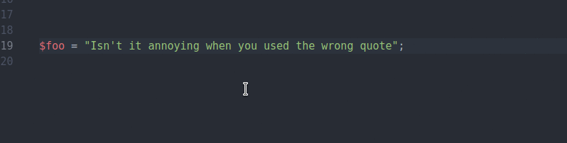
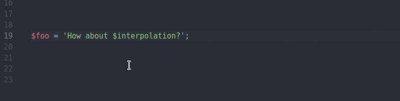

# atom switch-quotes package

Tired of writing out string only to discover you used the wrong quote character? `switch-quotes` to the rescue.

##### Supports:
1. Multi Lines
1. Nested quote characters
1. Heredoc and Nowdoc
1. Multi cursors
1. String interpolation

##### Languages:
Toggling between single and double quote should work for all languages.
Full range of string types are supported for:
1. javascipt (inc. ES6)
1. PHP
1. python
1. C/C++

##### Usage:
Simply place the cursor within a quoted block of text and hit `alt-'` to cycle between each string type for the current grammar, or `ctrl-'` to toggle between single and double quotes.

Highlight a selection within an existing string and hit `ctrl-'` to convert it to an interpolated value. If the selection is discovered to be an existing value, the full value will be selected, otherwise only the selected range will be considered.

### Notes
This package is in its early days. I need testers and I need those testers to give feedback. If there any features you require or bugs found, please raise an issue on the github repo.

In order for me to support new languages, I need first need to know how the strings in that language are structured. Giving me a sample file containing all possible string types, multiline types and interpolated types will speed up the process. Also, pressing `Alt + *`, while the cursor is within a string will
log to the console (`Ctrl + Shift + I` within atom) the name of the grammar and scope of the string.
